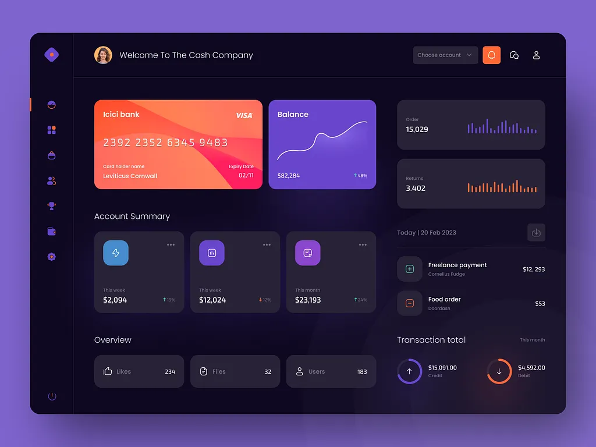

# ⚡ Scraperrr

> Your daily AI intelligence hub — aggregating the latest AI news from **Ben's Bites**, **The AI Rundown**, and **Reddit** into one beautiful, filterable dashboard.



---

## ✨ Features

- 📰 **Multi-source aggregation** — Ben's Bites (Substack RSS), The AI Rundown (Beehiiv RSS), Reddit r/artificial & r/MachineLearning
- 🔖 **Save articles** — Persist your reading list via `localStorage` (survives page refresh)
- 🔍 **Live search** — Filter articles by title, summary, or source in real-time
- 🏷️ **Source filters** — Sidebar navigation to filter by source
- ♻️ **Auto-refresh** — Triggers a new scrape automatically every 24 hours
- 💀 **Skeleton loading** — Premium shimmer skeletons while data loads
- 📱 **Fully responsive** — Mobile-first layout with slide-in sidebar
- 🎨 **Dark mode** — Neon-pink/black design system with Aspekta + Inter typography

---

## 🚀 Quick Start

### 1. Install dependencies
```bash
pip install -r requirements.txt
```

### 2. Configure environment
Copy `.env.example` to `.env` and fill in your Reddit API credentials:
```bash
cp .env.example .env
```

```env
REDDIT_CLIENT_ID=your_reddit_client_id_here
REDDIT_CLIENT_SECRET=your_reddit_client_secret_here
REDDIT_USER_AGENT=Scraperrr/1.0 by yourusername
```

> **Note:** Reddit credentials are optional — the scraper will still fetch RSS feeds without them.

### 3. Run the scraper
```bash
python tools/scraper.py
```

This writes fresh articles to `.tmp/articles.json`.

### 4. Start the dashboard server
```bash
python server.py
```

Then open **http://127.0.0.1:3000/dashboard/** in your browser.

The **Refresh** button in the dashboard triggers a live scrape on demand.

---

## 📁 Project Structure

```
Scraperrr/
├── .env                   # API Keys (not committed)
├── requirements.txt       # Python dependencies
├── server.py              # Local dev server (serves dashboard + /run-scraper)
├── tools/
│   └── scraper.py         # Python scraper (RSS + Reddit → .tmp/articles.json)
├── dashboard/
│   ├── index.html         # Dashboard UI
│   ├── style.css          # Design system
│   └── app.js             # Dashboard logic + localStorage
└── .tmp/
    └── articles.json      # Scraper output (ephemeral, not committed)
```

---

## 🔧 Sources

| Source | Type | Status |
|---|---|---|
| Ben's Bites | Substack RSS | ✅ Active |
| The AI Rundown | Beehiiv RSS | ✅ Active |
| Reddit r/artificial | PRAW API | 🟡 Requires credentials |
| Reddit r/MachineLearning | PRAW API | 🟡 Requires credentials |

---

## 🛣️ Roadmap

- [x] Phase 1 — Local dashboard with localStorage persistence
- [ ] Phase 2 — Supabase backend for cloud persistence & cross-device sync
- [ ] Phase 3 — Email digest / push notifications

---

## 📜 License

MIT — build something cool with it.
